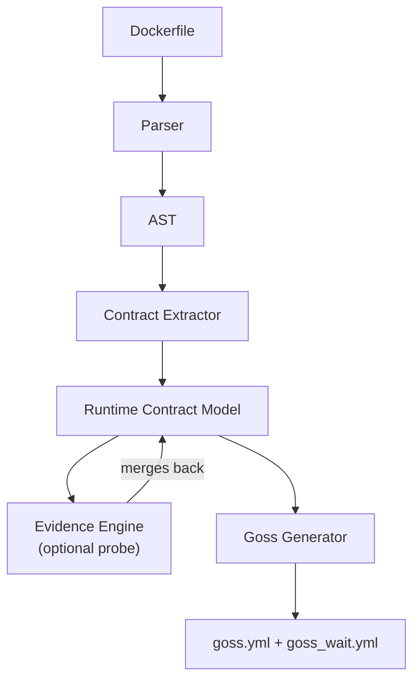

# dgossgen

[](https://github.com/dortort/dgossgen/actions/workflows/ci.yml)
[](https://github.com/dortort/dgossgen/actions/workflows/release.yml)
[](https://opensource.org/licenses/MIT)
[](https://www.rust-lang.org)

Generate [dgoss](https://github.com/goss-org/goss/tree/master/extras/dgoss)-ready test suites from Dockerfiles.

## Why

[Goss](https://github.com/goss-org/goss) is a declarative server validation framework — you write YAML assertions about processes, ports, files, users, and commands, and Goss verifies them. [dgoss](https://github.com/goss-org/goss/tree/master/extras/dgoss) wraps Goss for Docker: it starts a container from an image and runs those checks against the live instance.

This fills a gap in the container pipeline. Dockerfile linters and CVE scanners run *before* or *without* execution, but neither answers the question that matters most: does the built image actually behave like the intended runtime environment? Ports listening on the right interface, processes running as the expected user, config files landing in the right place, health endpoints responding — these only surface at deploy time if not tested earlier. ([more context](https://dortort.com/posts/runtime-contract-tests-with-dgoss/))

The catch is that writing `goss.yml` by hand means re-encoding facts already declared in the Dockerfile. dgossgen automates that: it reads your Dockerfile, extracts the runtime contract, and generates the test suite so you can run `dgoss run` without the boilerplate.

## What it produces

dgossgen ingests a Dockerfile (optionally plus build context metadata) and outputs:
- **`goss.yml`** — core assertions (files, ports, processes, commands)
- **`goss_wait.yml`** — optional readiness gate assertions run by dgoss before the main tests

## Features

- **Static analysis** of Dockerfiles: multi-stage builds, ARG/ENV variable resolution, all major instructions
- **Contract extraction**: infers ports, processes, files, users, entrypoints, healthchecks, volumes, working directory
- **Dynamic probe mode**: builds and runs the container to collect evidence (listening ports, running processes, file existence) and raise assertion confidence
- **Confidence scoring**: each assertion carries a provenance comment and confidence level (high/medium/low)
- **Profiles**: `minimal` (CI-safe, low flake), `standard` (balanced), `strict` (ownership, modes, more assertions)
- **Interactive mode**: guided Q&A, preview, accept/edit/regenerate workflow
- **Non-interactive mode**: deterministic, CI-friendly output with sensible defaults
- **Lint command**: validates existing goss YAML and detects likely flaky assertions
- **Explain command**: prints derivation report showing why each assertion exists
- **Policy config file** (`.dgossgen.yml`): tune assertion types, wait parameters, secret redaction, service patterns

## Installation

### One-liner (macOS and Linux)

```sh
curl -fsSL https://raw.githubusercontent.com/dortort/dgossgen/main/install.sh | sh
```

The installer verifies the downloaded archive against the published `.sha256` checksum before installing.

To install to a custom directory:

```sh
INSTALL_DIR=~/.local/bin curl -fsSL https://raw.githubusercontent.com/dortort/dgossgen/main/install.sh | sh
```

### Homebrew (macOS and Linux)

```sh
brew install dortort/tap/dgossgen
```

### From source

```sh
cargo install --path .
```

### From releases

Download the binary for your platform from [GitHub Releases](https://github.com/dortort/dgossgen/releases).

Available targets:
- `x86_64-unknown-linux-gnu`
- `x86_64-unknown-linux-musl` (statically linked)
- `aarch64-unknown-linux-gnu`
- `x86_64-apple-darwin`
- `aarch64-apple-darwin`

## Quick start

```sh
# Generate test files from a Dockerfile (non-interactive)
dgossgen init -f Dockerfile

# Interactive mode with guided questions
dgossgen init -f Dockerfile --interactive

# Use dynamic probe for higher confidence
dgossgen probe -f Dockerfile

# Explain what was generated and why
dgossgen explain -f Dockerfile

# Lint existing goss files for flaky patterns
dgossgen lint goss.yml
```

## Commands

### `dgossgen init`

Generates `goss.yml` (and optional `goss_wait.yml`) from static Dockerfile analysis only. No Docker daemon required.

```sh
dgossgen init [OPTIONS]

Options:
  -f, --dockerfile <PATH>    Path to Dockerfile [default: Dockerfile]
  -c, --context <DIR>        Build context directory [default: .]
  -o, --output-dir <DIR>     Output directory [default: .]
      --target <STAGE>       Target build stage
      --build-arg <KEY=VAL>  Build argument (repeatable)
      --profile <PROFILE>    Generation profile: minimal|standard|strict [default: standard]
      --no-wait              Do not generate goss_wait.yml
      --force-wait           Force generation of goss_wait.yml
      --primary-port <N>     Override primary service port
      --health-path <PATH>   Health check endpoint path (e.g., /healthz)
      --health-status <CODE> Expected HTTP status [default: 200]
      --editor               Open $EDITOR after generation
  -i, --interactive          Run in interactive mode
```

### `dgossgen probe`

Builds and runs the container to collect evidence, then generates test files with higher confidence assertions.

```sh
dgossgen probe [OPTIONS]

Options:
      --runtime <RUNTIME>    Container runtime: docker|podman [default: docker]
      --run-arg <ARG>        Additional run argument (safe-mode allowlisted, repeatable)
      --unsafe-run-arg       Allow unrestricted run args (disables run-arg safety checks)
      --allow-network        Disable network isolation for probe container
  (plus all init options)
```

### `dgossgen explain`

Prints a derivation report explaining each assertion: type, provenance, source line, confidence, and description.

```sh
dgossgen explain [OPTIONS]
  (same options as init for Dockerfile selection)
```

### `dgossgen lint`

Validates existing goss YAML files and detects likely flaky patterns.

```sh
dgossgen lint [FILE] [--wait-file <PATH>]

Checks for:
  - Invalid YAML syntax
  - Assertions on ephemeral paths (/tmp/, /var/cache/, /proc/)
  - Excessive process assertions (>3 increases flake risk)
  - Commands without timeouts
```

## Profiles

| Profile    | Min confidence | File modes | Process assertions | Description                     |
|------------|---------------|------------|-------------------|---------------------------------|
| `minimal`  | High          | No         | Only high          | CI-safe, lowest flake risk      |
| `standard` | Medium        | No         | Medium+            | Balanced coverage               |
| `strict`   | Low           | Yes        | All                | Maximum coverage, all assertions |

## How it works

### Architecture



1. **Dockerfile Parser**: Parses the Dockerfile into an AST, handling multi-stage builds, continuation lines, variable substitution (`$VAR`, `${VAR:-default}`), and all instruction types.

2. **Contract Extractor**: Walks the target stage's instructions and produces a Runtime Contract Model containing:
   - Base image, workdir, user, env vars
   - Exposed ports, volumes
   - Entrypoint/CMD, healthcheck
   - Filesystem paths (from COPY/ADD)
   - Installed component hints (nginx, node, python, etc.)
   - Typed assertions with provenance and confidence

3. **Evidence Engine** (probe mode): Builds the image, runs the container, and inspects it to discover actual listening ports, running processes, and file existence. Evidence raises confidence of matching static assertions and discovers new ones.

4. **Goss Generator**: Maps the contract (plus evidence) to goss YAML resources, applying profile-based confidence cutoffs and policy configuration.

### Assertion provenance

Every generated assertion includes comments showing where it was derived from:

```yaml
file:
  # derived from COPY nginx.conf /etc/nginx/nginx.conf; confidence: medium
  /etc/nginx/nginx.conf:
    exists: true
    filetype: file

port:
  # derived from EXPOSE 8080/tcp; confidence: medium
  tcp:8080:
    listening: true
```

### goss_wait.yml generation

The wait file is automatically generated when:
- A `HEALTHCHECK` instruction exists (highest signal)
- Exactly one port is exposed (used as readiness gate)
- `--force-wait` is specified

Wait file generation is suppressed with `--no-wait`.

The wait file uses these checks in priority order:
1. Healthcheck-derived command
2. Primary port listening
3. Primary process running

## Configuration

Create a `.dgossgen.yml` file in your project root:

```yaml
# Assertion policies: required | optional | off
assert_ports: optional
assert_process: optional
assert_file_modes: false
http_checks: false

# Wait configuration
wait:
  retries: 60
  sleep: "1s"
  timeout: "60s"

# Paths to ignore
ignore_paths:
  - /tmp
  - /var/cache

# Secret key patterns (env vars matching these are redacted)
secret_patterns:
  - SECRET
  - TOKEN
  - PASSWORD
  - KEY
  - PRIVATE
  - CREDENTIAL
  - AUTH

# Custom service patterns
service_patterns:
  - name: nginx
    process: nginx
    config_path: /etc/nginx/nginx.conf
    version_cmd: "nginx -v"
```

## Examples

### Nginx Dockerfile

**Input:**
```dockerfile
FROM nginx:alpine
COPY nginx.conf /etc/nginx/nginx.conf
EXPOSE 80
HEALTHCHECK --interval=30s --timeout=3s CMD curl -f http://localhost/ || exit 1
CMD ["nginx", "-g", "daemon off;"]
```

**Generated `goss_wait.yml`:**
```yaml
command:
  # derived from HEALTHCHECK CMD curl -f http://localhost/ || exit 1; confidence: high
  healthcheck:
    exec: "curl -f http://localhost/ || exit 1"
    exit-status: 0
    timeout: 5000
port:
  # derived from EXPOSE 80/tcp; confidence: medium
  tcp:80:
    listening: true
```

**Generated `goss.yml`:**
```yaml
file:
  # derived from COPY nginx.conf /etc/nginx/nginx.conf; confidence: medium
  /etc/nginx/nginx.conf:
    exists: true
  # derived from nginx service pattern; confidence: medium
  /etc/nginx/nginx.conf:
    exists: true
    filetype: file

process:
  # derived from CMD nginx -g daemon off;; confidence: medium
  nginx:
    running: true

command:
  # derived from nginx service pattern; confidence: medium
  nginx--v:
    exec: "nginx -v"
    exit-status: 0
    timeout: 10000
```

### Go multi-stage Dockerfile

**Input:**
```dockerfile
FROM golang:1.21-alpine AS build
WORKDIR /src
COPY . .
RUN CGO_ENABLED=0 go build -o /bin/server ./cmd/server

FROM scratch
COPY --from=build /bin/server /server
EXPOSE 8080
USER 65534
ENTRYPOINT ["/server"]
```

**Generated `goss.yml`:**
```yaml
file:
  # derived from COPY --from=build /server; confidence: medium
  /server:
    exists: true

port:
  # derived from EXPOSE 8080/tcp; confidence: medium
  tcp:8080:
    listening: true

process:
  # derived from ENTRYPOINT /server; confidence: medium
  server:
    running: true

command:
  # derived from USER 65534; confidence: high
  id--u---grep--q-65534:
    exec: "id -u | grep -q 65534"
    exit-status: 0
    timeout: 10000
```

## Exit codes

| Code | Meaning                               |
|------|---------------------------------------|
| 0    | Success                               |
| 2    | Generation completed with warnings    |
| 1    | Fatal error (parse failure, etc.)     |

## Security

- **Secret redaction**: Environment variable values for keys matching `SECRET`, `TOKEN`, `PASSWORD`, `KEY`, etc. are never embedded in generated assertions
- **Probe isolation**: Probe containers run with `--network none` by default (override with `--allow-network`)
- **Probe run args**: `--run-arg` is allowlisted in safe mode; use `--unsafe-run-arg` only for trusted inputs
- **Command sanitization**: Dockerfile strings are treated as data; values are sanitized when embedded into YAML commands to prevent injection

## Development

```sh
# Build
cargo build

# Run tests
cargo test

# Run with a specific Dockerfile
cargo run -- init -f path/to/Dockerfile

# Check formatting and lints
cargo fmt -- --check
cargo clippy
```

## License

MIT
